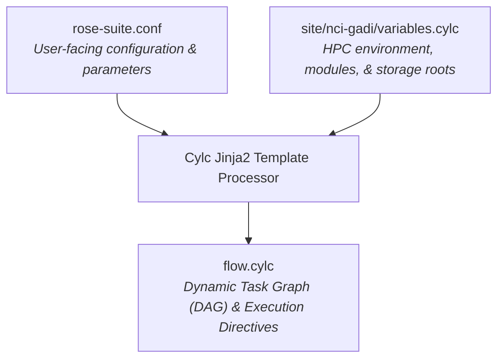

# Suite Configuration & Parameters Reference

The Cylc 8 workflow suite in `ACCESS-NRI/CMIP7-Input` is parameterized through a centralized configuration interface. This architecture decouples workflow logic in `flow.cylc` from site paths, dataset versions, experiment selections, and output filenames.

This document serves as an abstract, evergreen reference describing all configuration objects defined in `rose-suite.conf` and `site/nci-gadi/variables.cylc`.

> [!NOTE]
> This reference intentionally documents object **semantics, types, schemas, and usage contexts** without hardcoding current dataset version tags or dates. To inspect the current values active in a specific suite run, consult `rose-suite.conf` and the individual [Forcing Specifications](../forcings/overview.md).

---

## 1. Workflow Architecture & Configuration Loading

The workflow suite initializes its configuration through a two-stage template evaluation:

1. **User Parameters (`rose-suite.conf`):** Defines master switches, experiment selections, dataset versions, version dates, output filenames, and downstream Git branch rules.
2. **Site Abstractions (`site/<SITE>/variables.cylc`):** Injected based on the `SITE` template variable to provide host-specific filesystem roots, environment modules, and working paths.
3. **Graph Evaluation (`flow.cylc`):** Evaluates conditional Jinja2 blocks (``, ``) to dynamically build the task graph.

---

## 2. Master Forcing Execution Switches

These boolean flags govern whether entire forcing domains are included in the Cylc task graph. Setting a flag to `false` completely removes all associated preprocessing, regridding, ancillary formatting, and Git synchronization tasks from the execution graph.

| Parameter Name | Defining File | Type | Permitted Values | Functional Role in Workflow |
| :--- | :--- | :---: | :---: | :--- |
| `ANCIL_CREATE_AEROSOL` | `rose-suite.conf` | Boolean | `true`, `false` | Controls scheduling of anthropogenic, biomass burning, and marine DMS aerosol tasks across all active experiments. |
| `ANCIL_CREATE_AMIP` | `rose-suite.conf` | Boolean | `true`, `false` | Controls scheduling of AMIP sea-surface temperature and sea-ice concentration regridding and ancillary generation tasks. |
| `ANCIL_CREATE_CO2` | `rose-suite.conf` | Boolean | `true`, `false` | Controls scheduling of interactive $\text{CO}_2$ emissions flux interpolation tasks (`EH` and `ES`). |
| `ANCIL_CREATE_GHG` | `rose-suite.conf` | Boolean | `true`, `false` | Controls scheduling of greenhouse gas annual timeseries generation and downstream configuration namelist patching. |
| `ANCIL_CREATE_NITROGEN` | `rose-suite.conf` | Boolean | `true`, `false` | Controls scheduling of atmospheric reactive nitrogen surface deposition ancillary generation tasks. |
| `ANCIL_CREATE_OZONE` | `rose-suite.conf` | Boolean | `true`, `false` | Controls scheduling of UKESM ozone toolchain execution, regridding, and ancillary file generation tasks. |
| `ANCIL_CREATE_SOLAR` | `rose-suite.conf` | Boolean | `true`, `false` | Controls scheduling of Total Solar Irradiance namelist patching (`PI`) and annual ASCII forcing table generation (`HI`, `SM`). |
| `ANCIL_CREATE_VOLCANIC` | `rose-suite.conf` | Boolean | `true`, `false` | Controls scheduling of stratospheric aerosol optical depth namelist patching (`PI`) and annual ASCII forcing table generation (`HI`, `SM`). |

---

## 3. Experiment and Scenario Selection Selectors

These objects control which experiment suites and ScenarioMIP future projection pathways are materialized in the workflow graph.

| Parameter Name | Defining File | Type | Schema / Structure | Functional Role in Workflow |
| :--- | :--- | :---: | :--- | :--- |
| `EXPS` | `rose-suite.conf` | List[str] | List of experiment acronym strings (e.g. `['AM', 'EH', 'ES', 'HI', 'PI', 'PM', 'SM']`). | Master enumeration of all supported experiment suites recognized by the suite logic. |
| `MAIN_EXPS` | `rose-suite.conf` | List[str] | Subset list of experiment acronym strings. | Designates the primary coupled model experiments iterated over in standard graph loops (`HI`, `PI`, `SM`). |
| `USE_EXP` | `rose-suite.conf` | Dict[str, bool] | Keyed by experiment acronym (`'AM'`, `'EH'`, `'ES'`, `'HI'`, `'PI'`, `'PM'`, `'SM'`) to boolean. | Granular toggle allowing operators to activate (`True`) or bypass (`False`) individual experiment suites without modifying `flow.cylc`. |
| `SCENARIOS` | `rose-suite.conf` | List[str] | List of scenario tier identifiers (e.g. `['h', 'hl', 'm', 'vl']`). | Enumeration of supported future emissions pathways in ScenarioMIP. |
| `USE_SCEN` | `rose-suite.conf` | Dict[str, bool] | Keyed by scenario tier identifier to boolean. | Granular toggle allowing operators to activate (`True`) or bypass (`False`) individual ScenarioMIP pathways. |

---

## 4. ScenarioMIP Timeline and Extension Controls

These objects control the temporal horizons of future projection simulations, distinguishing between standard runs and extended simulations.

| Parameter Name | Defining File | Type | Schema / Format | Functional Role in Workflow |
| :--- | :--- | :---: | :--- | :--- |
| `CMIP7_SM_BEG_YEAR` | `rose-suite.conf` | String | 4-digit year string (`YYYY`). | Defines the initial simulation year for standard ScenarioMIP future pathways. |
| `CMIP7_SM_END_YEAR` | `rose-suite.conf` | String | 4-digit year string (`YYYY`). | Defines the nominal concluding year for standard ScenarioMIP simulations. |
| `CMIP7_SM_EXT_END_YEAR` | `rose-suite.conf` | String | 4-digit year string (`YYYY`). | Defines the extended concluding year for long-term commitment and stabilization simulations. |
| `EXTEND_SM_AEROSOL` | `rose-suite.conf` | Dict[str, bool] | Keyed by scenario tier to boolean. | Controls whether aerosol generation tasks concatenate extension chunks for that scenario. |
| `EXTEND_SM_CO2` | `rose-suite.conf` | Dict[str, bool] | Keyed by scenario tier to boolean. | Controls whether carbon-cycle emission tasks concatenate extension chunks for that scenario. |
| `EXTEND_SM_GHG` | `rose-suite.conf` | Dict[str, bool] | Keyed by scenario tier to boolean. | Controls whether greenhouse gas tasks concatenate extension chunks into the target namelists. |
| `EXTEND_SM_NITROGEN` | `rose-suite.conf` | Dict[str, bool] | Keyed by scenario tier to boolean. | Controls whether nitrogen deposition tasks apply constant-year tiling to reach the extended horizon. |
| `EXTEND_SM_OZONE` | `rose-suite.conf` | Dict[str, bool] | Keyed by scenario tier to boolean. | Controls whether ozone generation tasks tile climatological end-years to reach the extended horizon. |
| `EXTEND_SM_SOLAR` | `rose-suite.conf` | Boolean | `True`, `False` | Controls whether solar table generation tasks extend projected solar cycles to the long-term horizon. |
| `EXTEND_SM_VOLCANIC` | `rose-suite.conf` | Boolean | `True`, `False` | Controls whether volcanic table generation tasks sustain background optical depth to the extended horizon. |

---

## 5. Site, Environment, and Filesystem Roots

These objects abstract high-performance computing environment paths, module load environments, and storage layouts.

| Parameter Name | Defining File | Type | Format / Content | Functional Role in Workflow |
| :--- | :--- | :---: | :--- | :--- |
| `SITE` | `rose-suite.conf` | String | Site configuration name (e.g. `'nci-gadi'`). | Selects which `site/<SITE>/family.cylc` and `site/<SITE>/variables.cylc` template files are included. |
| `TESTING` | `rose-suite.conf` | Boolean | `true`, `false` | Enables test-suite mode, switching target directories and namelist destinations to sandbox locations. |
| `ISO_DATE_TODAY` | `rose-suite.conf` | String | Shell evaluation string (`$(isodatetime -f CCYY.MM.DD)`). | Generates a dynamic ISO date stamp used in versioned output directory names. |
| `MODULE_USE_DIR` | `variables.cylc` | Path String | Absolute directory path on shared storage. | Prepended to `MODULEPATH` in PBS job directives to expose software modules (e.g. ANTS). |
| `ANTS_MODULE` | `variables.cylc` | String | Module name and version string (`ants/<VERSION>`). | Module loaded by tasks utilizing the UK Met Office ANTS ancillary toolchain. |
| `CMIP7_SOURCE_PATH` | `variables.cylc` | Path String | Absolute directory path to input replicas. | Root filesystem location where incoming raw international `input4MIPs` NetCDF files are mirrored. |
| `ESM15_INPUTS_PATH` | `variables.cylc` | Path String | Absolute directory path to baseline inputs. | Root directory containing curated ACCESS-ESM1.5 input datasets, land-sea masks, and reference grids. |
| `ANCIL_TARGET_PATH` | `variables.cylc` | Path Template | Absolute path template with environment variables. | Target destination directory where generated ancillary binary files and forcing tables are written. |
| `UMDIR` | `variables.cylc` | Path String | Absolute directory path to Unified Model tree. | Base directory providing Unified Model system horizontal and vertical grid definition files. |

---

## 6. Input4MIPs Dataset Versioning & Metadata Parameters

These parameters define the exact dataset release tags, version dates, date ranges, and species selections read by generator scripts.

### 6.1 Anthropogenic & Biomass Aerosols
* `CMIP7_AEROSOL_ANTHRO_VERSION`: String. Source release version tag for anthropogenic emissions.
* `CMIP7_AEROSOL_ANTHRO_VDATE`: String. Publication version date directory tag (`vYYYYMMDD`) for anthropogenic emissions.
* `CMIP7_AEROSOL_BIOMASS_VERSION`: String. Source release version tag for biomass burning particulate emissions.
* `CMIP7_AEROSOL_BIOMASS_VDATE`: String. Publication version date directory tag for biomass burning emissions.
* `CMIP7_AEROSOL_BIOMASS_PERCENTAGE_DATE_RANGE`: String. Temporal span string (`YYYYMM-YYYYMM`) for biomass percentage partition files.
* `CMIP7_AEROSOL_SPECIES`: List[str]. Active aerosol chemical species identifiers (e.g. `['BC', 'OC']`).
* `CMIP7_HI_AEROSOL_ANTHRO_DATE_RANGE_LIST`: List[str]. Multi-chunk date range strings for historical anthropogenic emissions.
* `CMIP7_HI_AEROSOL_BIOMASS_DATE_RANGE_LIST`: List[str]. Multi-chunk date range strings for historical biomass burning emissions.
* `CMIP7_PI_AEROSOL_ANTHRO_DATE_RANGE`: String. Climatological date range string for pre-industrial anthropogenic emissions.
* `CMIP7_PI_AEROSOL_BIOMASS_DATE_RANGE`: String. Climatological date range string for pre-industrial biomass emissions.
* `CMIP7_SM_AEROSOL_VERSION`, `CMIP7_SM_AEROSOL_VDATE`: Dict[str, str]. Per-scenario source release version and date tags for standard projection emissions.
* `CMIP7_SM_AEROSOL_AIR_VERSION`, `CMIP7_SM_AEROSOL_AIR_VDATE`: Dict[str, str]. Per-scenario aircraft emission source release tags.
* `CMIP7_SM_EXT_AEROSOL_VERSION`, `CMIP7_SM_EXT_AEROSOL_VDATE`: Dict[str, str]. Per-scenario source release tags for extended projection emissions.
* `CMIP7_SM_EXT_AEROSOL_AIR_VERSION`, `CMIP7_SM_EXT_AEROSOL_AIR_VDATE`: Dict[str, str]. Per-scenario extended aircraft emission release tags.

### 6.2 Atmospheric Boundary Conditions (AMIP)
* `AMIP_VARS`: List[str]. Boundary variable names processed by AMIP tasks (`['seaice', 'sst']`).
* `CMIP7_AMIP_VERSION`: String. Source release version tag for observed sea surface temperatures and sea ice concentrations.
* `CMIP7_AMIP_VDATE`: String. Publication version date directory tag for AMIP boundary datasets.
* `CMIP7_AMIP_DATE_RANGE`: String. Temporal span string (`YYYYMM-YYYYMM`) covering observed AMIP boundary conditions.

### 6.3 Greenhouse Gas Concentrations
* `CMIP7_GHG_VERSION`, `CMIP7_GHG_VDATE`: Strings. Source release version and date tags for historical global-mean greenhouse gas concentrations.
* `CMIP7_GHG_DATE_RANGE`: String. Temporal span string (`YYYY-YYYY`) for historical greenhouse gas timeseries.
* `CMIP7_SM_GHG_VERSION`, `CMIP7_SM_GHG_VDATE`: Dict[str, str]. Per-scenario source release version and date tags for standard future projections.
* `CMIP7_SM_GHG_DATE_RANGE`: String. Temporal span string for standard future projections.
* `CMIP7_SM_EXT_GHG_VERSION`, `CMIP7_SM_EXT_GHG_VDATE`: Dict[str, str]. Per-scenario source release tags for extended future projections.
* `CMIP7_SM_EXT_GHG_DATE_RANGE`: String. Temporal span string for extended future projections.

### 6.4 Reactive Nitrogen Deposition
* `CMIP7_NITROGEN_VERSION`, `CMIP7_NITROGEN_VDATE`: Strings. Source release version and date tags for reactive nitrogen deposition fields.
* `CMIP7_HI_NITROGEN_DATE_RANGE`: String. Temporal span string for historical transient nitrogen deposition.
* `CMIP7_PI_NITROGEN_DATE_RANGE`: String. Climatological span string for pre-industrial cyclic nitrogen deposition.
* `CMIP7_SM_NITROGEN_VERSION`, `CMIP7_SM_NITROGEN_VDATE`: Dict[str, str]. Per-scenario source release tags for projection nitrogen deposition.
* `CMIP7_SM_NITROGEN_DATE_RANGE`: String. Temporal span string for projection nitrogen deposition.

### 6.5 Atmospheric Ozone Chemistry
* `CMIP7_OZONE_ZMTA_VERSION`, `CMIP7_OZONE_ZMTA_VDATE`: Strings. Release tags for zonal-mean tropospheric and stratospheric ozone fields.
* `CMIP7_HI_OZONE_VERSION`, `CMIP7_HI_OZONE_VDATE`: Strings. Release tags for historical 3D ozone fields.
* `CMIP7_HI_OZONE_BEG_YEAR`, `CMIP7_HI_OZONE_END_YEAR`: Strings. Temporal boundary years for historical transient ozone.
* `CMIP7_PI_MEAN_OZONE_VERSION`, `CMIP7_PI_MEAN_OZONE_VDATE`: Strings. Release tags for equilibrium multi-year mean pre-industrial ozone.
* `CMIP7_PI_MEAN_OZONE_BEG_YEAR`, `CMIP7_PI_MEAN_OZONE_END_YEAR`: Strings. Multi-year averaging temporal bounds for pre-industrial ozone.
* `CMIP7_SM_OZONE_VERSION`, `CMIP7_SM_OZONE_VDATE`: Dict[str, str]. Per-scenario release tags for projection ozone fields.
* `CMIP7_SM_OZONE_DATE_RANGE_LIST`: List[str]. Multi-chunk date range strings for projection ozone extraction.

### 6.6 Solar and Volcanic Forcings
* `CMIP7_SOLAR_VERSION`, `CMIP7_SOLAR_VDATE`: Strings. Source release tags for historical and pre-industrial Total Solar Irradiance.
* `CMIP7_HI_SOLAR_DATE_RANGE`: String. Temporal span string for historical solar irradiance.
* `CMIP7_SM_SOLAR_VERSION`, `CMIP7_SM_SOLAR_VDATE`: Strings. Source release tags for projected future solar irradiance cycles.
* `CMIP7_SM_SOLAR_DATE_RANGE`: String. Temporal span string for projected future solar cycles.
* `CMIP7_VOLCANIC_VERSION`, `CMIP7_VOLCANIC_VDATE`: Strings. Source release tags for historical and pre-industrial volcanic aerosol optical depth.
* `CMIP7_HI_VOLCANIC_DATE_RANGE`, `CMIP7_PI_VOLCANIC_DATE_RANGE`: Strings. Temporal span strings for historical and pre-industrial volcanic timeseries.
* `CMIP7_SM_VOLCANIC_VERSION`, `CMIP7_SM_VOLCANIC_VDATE`: Strings. Source release tags for projection volcanic background optical depth.

---

## 7. Output Filename Configuration Parameters

These parameters define the target file basenames for generated binary ancillaries, ASCII forcing tables, and intermediate NetCDF files.

| Parameter Name | Defining File | Type | Schema / Mapping Structure |
| :--- | :--- | :---: | :--- |
| `ESM_PI_<FORCING>_SAVE_FILENAME` | `rose-suite.conf` | String or Dict | Basename(s) for pre-industrial ancillary output files. |
| `ESM_HI_<FORCING>_SAVE_FILENAME` | `rose-suite.conf` | String or Dict | Basename(s) for historical transient ancillary output files. |
| `ESM_SM_<FORCING>_SAVE_FILENAME` | `rose-suite.conf` | Dict[str, Dict] | Nested dictionary mapping scenario and species to standard projection filenames. |
| `ESM_SM_EXT_<FORCING>_SAVE_FILENAME` | `rose-suite.conf` | Dict[str, Dict] | Nested dictionary mapping scenario and species to extended projection filenames. |
| `ESM_EH_CO2_SAVE_FILENAME` | `rose-suite.conf` | String | Basename for emission-driven historical carbon flux ancillary file. |
| `ESM_ES_CO2_SAVE_FILENAME` | `rose-suite.conf` | Dict[str, str] | Dictionary mapping scenario to standard projection emission flux filename. |
| `ESM_ES_EXT_CO2_SAVE_FILENAME` | `rose-suite.conf` | Dict[str, str] | Dictionary mapping scenario to extended projection emission flux filename. |
| `UKESM_*_NETCDF_FILENAME` | `rose-suite.conf` | String or Dict | Basename(s) for intermediate NetCDF cubes generated during toolchain regridding. |

---

## 8. Grid, Orog, and Land-Sea Mask Parameters

These parameters identify the target spatial grids and reference directories utilized by the ANTS regridding pipelines.

| Parameter Name | Defining File | Type | Functional Role in Regridding |
| :--- | :--- | :---: | :--- |
| `HORIZ` | `rose-suite.conf` | String | Horizontal target grid code (e.g. `'n96'`). Injected into ANTS and Iris spatial interpolation routines. |
| `ESM_GRID_DIRNAME` | `rose-suite.conf` | String | Target horizontal grid directory component (e.g. `'global.N96'`). |
| `ESM15_GRID_VERSION` | `rose-suite.conf` | String | Version date stamp identifying the reference grid definition directory in `ESM15_INPUTS_PATH`. |
| `ESM15_LANDFRAC_VERSION` | `rose-suite.conf` | String | Version date stamp identifying the land-fraction mask directory in `ESM15_INPUTS_PATH`. |
| `ESM15_OROG_VERSION` | `rose-suite.conf` | String | Version date stamp identifying the surface orography definition directory. |
| `ESM15_VERT_VERSION` | `rose-suite.conf` | String | Version date stamp identifying the vertical hybrid level coordinate definition file (`vertlevs_G3`). |
| `ESM15_AEROSOL_VERSION` | `rose-suite.conf` | Dict[str, str] | Maps experiment acronym to reference aerosol grid version directory for background comparison. |

---

## 9. Downstream Git Synchronization Parameters

These parameters govern automated cloning, branch creation, namelist patching, and remote pushing to the downstream configuration repository.

| Parameter Name | Defining File | Type | Functional Role in Git Synchronization |
| :--- | :--- | :---: | :--- |
| `GIT_ORG_URL` | `rose-suite.conf` | String | Base organization URL or SSH prefix (e.g. `'git@github.com:ACCESS-NRI'`). |
| `GIT_CONFIG_REPO` | `rose-suite.conf` | String | Target configuration repository name (e.g. `'access-esm1.6-configs'`). |
| `GIT_CONFIG_BRANCH_PUSH` | `rose-suite.conf` | Boolean | Global execution switch: if `true`, pushed generated branches upstream to GitHub; if `false`, retains branches locally in suite workspace. |
| `GIT_CONFIG_BRANCH_PRE` | `rose-suite.conf` | Dict[str, str] | Maps experiment acronym to the cloned base branch prefix (e.g. `'dev'`). |
| `GIT_CONFIG_BRANCH_SUF` | `rose-suite.conf` | Dict[str, str] | Maps experiment acronym to the cloned base branch suffix (e.g. `'historical'`, `'piControl'`). |
| `GIT_SM_CONFIG_BRANCH_SUF` | `rose-suite.conf` | Dict[str, str] | Maps scenario tier identifier to the ScenarioMIP base branch suffix. |
| `GIT_AMIP_SCRIPTS_REPO`, `_BRANCH` | `rose-suite.conf` | Strings | Remote repository name and branch cloned by unattended batch tasks for AMIP scripts. |
| `GIT_OZONE_SCRIPTS_REPO`, `_BRANCH` | `rose-suite.conf` | Strings | Remote repository name and branch cloned by unattended batch tasks for ozone scripts. |
