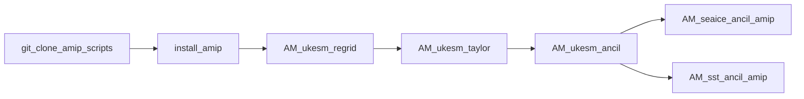

# Experiment Summary: AMIP (AM)

The Atmospheric Model Intercomparison Project (`AMIP` or `AM`) configures atmosphere-only simulations driven by observed monthly sea surface temperatures (SST) and sea-ice concentrations (SIC).

---

## Physical Forcing Rationale & Setup

In coupled climate simulations (like `HI` and `PI`), the atmosphere exchanges heat and moisture interactively with the dynamic ocean model (MOM5) and sea ice model (CICE4). In AMIP simulations:

* **Ocean Dynamics Disabled:** The ocean is replaced by prescribed, observed monthly boundary condition ancillary files.
* **Prescribed SST:** Monthly sea surface skin temperature (Kelvin) driving lower boundary atmospheric fluxes (STASH `m01s00i024`).
* **Prescribed Sea Ice:** Monthly sea-ice fractional area coverage and ice surface properties (STASH `m01s00i031` / `m01s00i032`).
* **Source Observations:** Global monthly SST and SIC fields from PCMDI (`PCMDI-AMIP-1-1-10`) spanning 1870 to 2022.

---

## Complete Task Roster for AMIP

The following **7 Cylc workflow tasks** execute the AMIP boundary generation pipeline:

| Task Name | Pipeline Stage | Script Entrypoint | Input / Prerequisite | Output Artifact | Technical Specification |
| :--- | :--- | :--- | :--- | :--- | :---: |
| `git_clone_amip_scripts` | Setup | Bash (`git clone`) | `ancillary-file-science` (`1-port-cmip7-amip-code...`) | Cloned repository | [View Card](../forcings/amip.md#1-amip-infrastructure-tasks) |
| `install_amip` | Setup | `pip install` | Cloned repository | Installed environment | [View Card](../forcings/amip.md#1-amip-infrastructure-tasks) |
| `AM_ukesm_regrid` | Upstream Regrid | UKESM AMIP toolchain | `PCMDI-AMIP-1-1-10` NetCDF | Regridded NetCDF | [View Card](../forcings/amip.md#2-upstream-ukesm-regridding-tasks) |
| `AM_ukesm_taylor` | Quality QA | UKESM AMIP toolchain | Regridded NetCDF | Taylor quality report | [View Card](../forcings/amip.md#2-upstream-ukesm-regridding-tasks) |
| `AM_ukesm_ancil` | Upstream Ancil | UKESM AMIP toolchain | Regridded NetCDF | Intermediate NetCDF | [View Card](../forcings/amip.md#2-upstream-ukesm-regridding-tasks) |
| `AM_seaice_ancil_amip` | UM Ancillary | `amip.cmip7_AM_amip_generate` | `seaice_amip_n96_gregorian.nc` | `seaice_amip_n96_gregorian.anc` | [View Card](../forcings/amip.md#am_seaice_ancil_amip) |
| `AM_sst_ancil_amip` | UM Ancillary | `amip.cmip7_AM_amip_generate` | `sst_amip_n96_gregorian.nc` | `sst_amip_n96_gregorian.anc` | [View Card](../forcings/amip.md#am_sst_ancil_amip) |

---

## Downstream Configuration Integration

Artifacts feed into the `amip` configuration branch in `access-esm1.6-configs`:

* **Installation Directory:**  
  `/g/data/${PROJECT}/${USER}/CMIP7/esm1p6_ancil/<ISO_DATE_TODAY>/modern/amip/atmosphere/boundary_conditions/global.N96/<ANCIL_TODAY>/`
* **Model Namelist References:**  
  The generated files are referenced in `atmosphere/namelists` to drive the lower boundary condition reader for SST and SIC.

---

## Execution Flow & Dependencies

