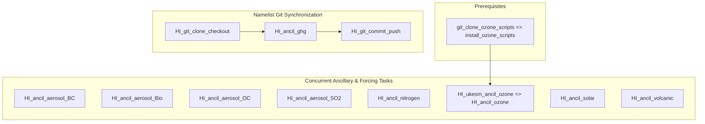

# Experiment Summary: Historical (HI)

The Historical (`HI` or `historical`) experiment simulates the continuous transient evolution of Earth's climate from 1850 to 2023, forced by observed historical emissions, atmospheric concentrations, solar variability, and volcanic eruptions.

---

## Physical Forcing Rationale & Setup

The historical forcing suite provides transient, continuous boundary conditions across the 175-year timeline:
* **Greenhouse Gases:** Annual global-mean surface concentrations for 9 species from 1850 to 2024 interpolated to January 1 and injected into `&clmchfcg`.
* **Total Solar Irradiance:** Transient annual solar variability from SOLARIS-HEPPA padded from 1700 to 2300 in `TSI_CMIP7_ESM`.
* **Volcanic Optical Depth:** Monthly 4-band stratospheric aerosol optical depth (SAOD) from UOEXETER capturing major historical eruptions (Krakatoa, Mount Pinatubo, El Chichón) in `volcts_cmip7.dat`.
* **Aerosol & DMS Emissions:** Monthly gridded emissions of anthropogenic BC, OC, and SO2 from CEDS alongside marine DMS.
* **Biomass Burning:** Monthly particulate emissions from BB4CMIP7.
* **Reactive Nitrogen:** Monthly deposition fluxes from FZJ.
* **Ozone:** Monthly 3D zonal-mean ozone concentrations on N96 L85 derived from UKESM1.

---

## Complete Task Roster for Historical

The following **12 Cylc workflow tasks** generate all necessary ancillaries and namelist patches for the `HI` configuration:

| Task Name | Forcing Domain | Python Script Entrypoint | Primary Input / Dataset | Output Type / Destination | Technical Specification |
| :--- | :--- | :--- | :--- | :--- | :---: |
| `HI_ancil_ghg` | Greenhouse Gases | `ghg.cmip7_HI_ghg_generate` | `CR-CMIP-1-0-0` (gm yr) | Namelist patch (`&clmchfcg`) | [View Card](../forcings/ghg.md#hi_ancil_ghg) |
| `HI_ancil_aerosol_BC` | Aerosols | `aerosol.cmip7_HI_BC_interpolate` | `CEDS-CMIP-2025-04-18` | `.anc` (`BC_1849_2023_cmip7.anc`) | [View Card](../forcings/aerosols.md#2-historical-experiment-hi) |
| `HI_ancil_aerosol_Bio` | Aerosols | `aerosol.cmip7_HI_Bio_interpolate`| `BB4CMIP7` biomass | `.anc` (`Bio_1849_2023_cmip7.anc`) | [View Card](../forcings/aerosols.md#2-historical-experiment-hi) |
| `HI_ancil_aerosol_OC` | Aerosols | `aerosol.cmip7_HI_OC_interpolate` | `CEDS-CMIP-2025-04-18` | `.anc` (`OCFF_1849_2023_cmip7.anc`) | [View Card](../forcings/aerosols.md#2-historical-experiment-hi) |
| `HI_ancil_aerosol_SO2` | Aerosols | `aerosol.cmip7_HI_SO2_interpolate`| `CEDS-CMIP` + ESM1.5 DMS | `.anc` (`scycl_1849_2023_cmip7.anc`) | [View Card](../forcings/aerosols.md#hi_ancil_aerosol_so2-specification-details) |
| `HI_ancil_nitrogen` | Nitrogen | `nitrogen.cmip7_HI_nitrogen_generate`| `FZJ-CMIP-nitrogen-1-2` | `.anc` (`Ndep_1849_2023_cmip7.anc`) | [View Card](../forcings/nitrogen.md#hi_ancil_nitrogen) |
| `HI_ukesm_ancil_ozone` | Ozone | UKESM ozone toolchain | UKESM1 annual NetCDF | Intermediate NetCDF | [View Card](../forcings/ozone.md#hi_ukesm_ancil_ozone-hi_ancil_ozone) |
| `HI_ancil_ozone` | Ozone | `ozone.cmip7_HI_ozone_generate` | Intermediate NetCDF | `.anc` (`ozone_1849_2023_cmip7.anc`) | [View Card](../forcings/ozone.md#hi_ukesm_ancil_ozone-hi_ancil_ozone) |
| `HI_ancil_solar` | Solar | `solar.cmip7_HI_solar_generate` | `SOLARIS-HEPPA-CMIP-4-6` | ASCII `TSI_CMIP7_ESM` | [View Card](../forcings/solar.md#hi_ancil_solar) |
| `HI_ancil_volcanic` | Volcanic | `volcanic.cmip7_HI_volcanic_generate`| `UOEXETER-CMIP-2-2-1` | ASCII `volcts_cmip7.dat` | [View Card](../forcings/volcanic.md#hi_ancil_volcanic) |
| `HI_git_clone_checkout`| Git Sync | Bash (`git clone`) | `access-esm1.6-configs` | Local workspace checkout | [View Card](../forcings/config_sync.md#hi_git_clone_checkout) |
| `HI_git_commit_push` | Git Sync | Bash (`git commit/push`) | Modified `atmosphere/namelists` | Downstream git configuration branch | [View Card](../forcings/config_sync.md#hi_git_commit_push) |

---

## Downstream Configuration Integration

Artifacts feed directly into the `dev-historical` configuration branch in `access-esm1.6-configs`:
* **Namelist Updates:**
  * `atmosphere/namelists`: Populates `&clmchfcg` with 175 annual points (1850–2024) of mass mixing ratios for the 11 greenhouse gas species.
* **Ancillary Installation:**
  Files installed into `/g/data/${PROJECT}/${USER}/CMIP7/esm1p6_ancil/<DATE>/modern/historical/`:
  * `atmosphere/aerosol/global.N96/<DATE>/` (`BC_1849_2023_cmip7.anc`, `Bio_1849_2023_cmip7.anc`, `OCFF_1849_2023_cmip7.anc`, `scycl_1849_2023_cmip7.anc`)
  * `atmosphere/nitrogen/global.N96/<DATE>/` (`Ndep_1849_2023_cmip7.anc`)
  * `atmosphere/forcing/global.N96/<DATE>/` (`ozone_1849_2023_cmip7.anc`, `TSI_CMIP7_ESM`, `volcts_cmip7.dat`)

---

## Execution Flow & Dependencies

