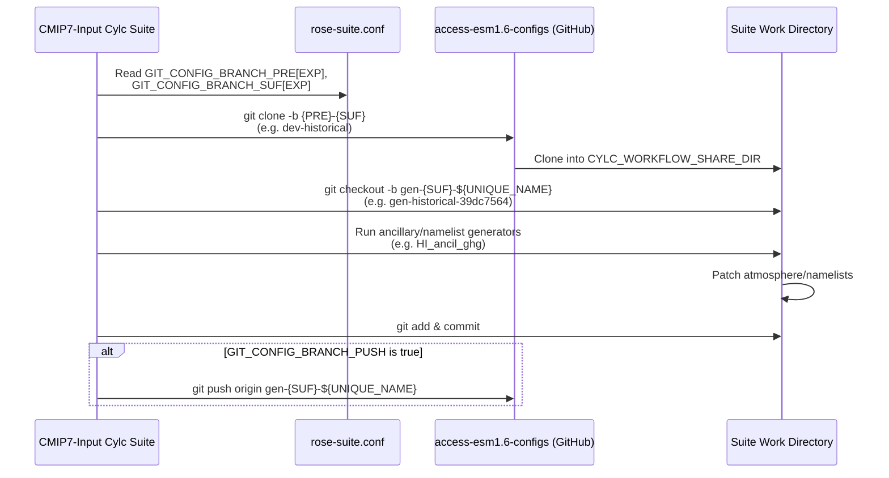

# Experiment Naming & Configuration Alignment

This page provides a definitive bidirectional mapping between the experiment naming conventions used in [`CMIP7-Input`](https://github.com/ACCESS-NRI/cmip7-input) and [`access-esm1.6-configs`](https://github.com/ACCESS-NRI/access-esm1.6-configs). It serves as a Rosetta Stone for workflow developers, model operators, and domain scientists who work across both repositories.

---

## Architectural Roles

The two repositories address different stages of the forcing pipeline:

| Dimension | `CMIP7-Input` | `access-esm1.6-configs` |
| :--- | :--- | :--- |
| **Role** | **Producer** — generates ancillary files, ASCII boundary conditions, and namelist patches from raw input4MIPs data | **Consumer** — integrates the generated artifacts into versioned model configurations |
| **Tooling** | Cylc 8, Iris, ANTS, Mule, xarray | Payu, CABLE, UM, MOM5, CICE4 |
| **Naming Focus** | Cylc suite acronyms and task IDs (e.g. `HI_ancil_ghg`) | Git branch names (e.g. `dev-historical+concentrations`) |

The automated [Configuration Git Synchronization](../forcings/config_sync.md) pipeline bridges the two: Cylc tasks clone an `access-esm1.6-configs` branch, patch namelists, and optionally push a new `gen-*` branch.

---

## `CMIP7-Input` Naming Convention

### Suite Acronyms

All workflow task names are prefixed with a two-letter experiment acronym defined in `rose-suite.conf` via the `EXPS` list:

| Acronym | WCRP Experiment ID | Description |
| :---: | :--- | :--- |
| `PI` | `piControl` | Pre-industrial control — perpetual 1850 equilibrium |
| `HI` | `historical` | Historical transient — 1850–2023 |
| `SM` | ScenarioMIP | Future projections (`scen7-h`, `scen7-hl`, `scen7-m`, `scen7-vl`) |
| `AM` | `amip` | Atmospheric Model Intercomparison — prescribed SST & sea ice |
| `EH` | `esm-hist` | Emission-driven historical — interactive carbon cycle |
| `ES` | `esm-ssp*` | Emission-driven ScenarioMIP — interactive carbon cycle |
| `PM` | `pmip` | Paleoclimate / PMIP — climatological equilibrium ozone |

### Task Identifier Syntax

Task names follow the pattern:

```
{EXP}[_{SCEN}]_ancil_{forcing}
```

Examples:

- `HI_ancil_ghg` — Historical greenhouse gas namelist generation
- `SM_h_ancil_aerosol_BC` — ScenarioMIP high-tier black carbon aerosol ancillary
- `AM_sst_ancil_amip` — AMIP sea surface temperature ancillary

### Scenario Extensions

ScenarioMIP tasks use the `USE_SCEN` dictionary to select among four Fast Track tiers:

| Scenario Key | CMIP7 Tier | Standard Range | Extended Range (`--ext`) |
| :---: | :--- | :---: | :---: |
| `h` | High | 2022–2100 | 2022–2150 |
| `hl` | High-Low | 2022–2100 | 2022–2150 |
| `m` | Medium | 2022–2100 | 2022–2150 |
| `vl` | Very Low | 2022–2100 | 2022–2150 |

---

## `access-esm1.6-configs` Naming Convention

### Branch Taxonomy

Branch names in `access-esm1.6-configs` follow the scheme:

```
{prefix}-{scenario}[+{modifier}]
```

**Prefixes:**

| Prefix | Purpose |
| :--- | :--- |
| `release-` | Tested, versioned, official community release configurations |
| `dev-` | Active development configurations under continuous integration |
| `gen-` | Automatically generated downstream branches pushed by `CMIP7-Input` Cylc tasks |
| `test-` | Ad-hoc scientific benchmarking and test configurations |

**Scenario Tokens:**

| Token | Description |
| :--- | :--- |
| `preindustrial` | 1850 perpetual equilibrium control run |
| `historical` | 1850–2023 transient historical simulation |
| `amip` | Atmospheric Model Intercomparison with observed SSTs and sea ice |
| `1pctCO2` | 1% compound annual increase in atmospheric CO₂ |
| `4xCO2` | Abrupt 4× pre-industrial CO₂ quadrupling |
| `flat10` | Idealized constant-forcing benchmark |
| `scen7-h`, `scen7-hl`, `scen7-m`, `scen7-vl` | ScenarioMIP Fast Track projection tiers |

**Modifier Tokens:**

| Modifier | Description |
| :--- | :--- |
| `+concentrations` | Prescribed atmospheric GHG concentrations |
| `+emissions` | Interactive carbon-cycle emissions (prescribed fluxes) |
| `+CN` | Active terrestrial Carbon-Nitrogen (and Phosphorus) nutrient dynamics |
| `-bgc` | Biogeochemically coupled carbon (radiation sees constant CO₂) |
| `-rad` | Radiatively coupled carbon (biogeochemistry sees constant CO₂) |
| `+noLUC` | Runs holding land-use change static at 1850 |

---

## Master Alignment Matrix

The following table maps every `CMIP7-Input` experiment to its corresponding `access-esm1.6-configs` branches. The **Suite Variables** column shows how the branch name is constructed from `rose-suite.conf` parameters. See the [Suite Configuration & Parameters Reference](../configuration/suite_objects.md) for full object declarations.

| CMIP7-Input Acronym | WCRP Experiment ID | Base Branch (`dev-*`) | Suite Variables | Generated Branch (`gen-*`) | Forcing Mode |
| :---: | :--- | :--- | :--- | :--- | :--- |
| **`PI`** | `piControl` | `dev-preindustrial+concentrations` | `GIT_CONFIG_BRANCH_PRE['PI']`-`GIT_CONFIG_BRANCH_SUF['PI']` = `dev`-`piControl` | `gen-piControl-${UNIQUE_NAME}` | Prescribed Concentrations |
| **`HI`** | `historical` | `dev-historical+concentrations` | `GIT_CONFIG_BRANCH_PRE['HI']`-`GIT_CONFIG_BRANCH_SUF['HI']` = `dev`-`historical` | `gen-historical-${UNIQUE_NAME}` | Prescribed Concentrations |
| **`SM`** (h) | `scen7-h` | `pl-scen7-h` | `GIT_CONFIG_BRANCH_PRE['SM']`-`GIT_SM_CONFIG_BRANCH_SUF['h']` = `pl`-`scen7-h` | `gen-scen7-h-${UNIQUE_NAME}` | Prescribed Concentrations |
| **`SM`** (hl) | `scen7-hl` | `pl-scen7-hl` | `GIT_CONFIG_BRANCH_PRE['SM']`-`GIT_SM_CONFIG_BRANCH_SUF['hl']` = `pl`-`scen7-hl` | `gen-scen7-hl-${UNIQUE_NAME}` | Prescribed Concentrations |
| **`SM`** (m) | `scen7-m` | `pl-scen7-m` | `GIT_CONFIG_BRANCH_PRE['SM']`-`GIT_SM_CONFIG_BRANCH_SUF['m']` = `pl`-`scen7-m` | `gen-scen7-m-${UNIQUE_NAME}` | Prescribed Concentrations |
| **`SM`** (vl) | `scen7-vl` | `pl-scen7-vl` | `GIT_CONFIG_BRANCH_PRE['SM']`-`GIT_SM_CONFIG_BRANCH_SUF['vl']` = `pl`-`scen7-vl` | `gen-scen7-vl-${UNIQUE_NAME}` | Prescribed Concentrations |
| **`AM`** | `amip` | `dev-amip` | N/A (filesystem ancillaries) | N/A | Prescribed Boundary Conditions |
| **`EH`** | `esm-hist` | `dev-historical+emissions` | N/A (filesystem ancillaries) | N/A | Emission-driven Fluxes |
| **`ES`** | `esm-ssp*` | `dev-scen7-{scen}+emissions` | N/A (filesystem ancillaries) | N/A | Emission-driven Fluxes |
| **`PM`** | `pmip` | `dev-preindustrial+concentrations` | N/A (filesystem ancillaries) | N/A | Climatological Equilibrium |

---

## Key Nuances and Discrepancies

### `preindustrial` vs. `piControl`

The two repositories use different names for the same concept:

- **`access-esm1.6-configs`** uses `preindustrial` in branch names (e.g. `dev-preindustrial+concentrations`) for readability and consistency with its existing branch taxonomy.
- **`CMIP7-Input`** uses `piControl` (the official WCRP CMIP Controlled Vocabulary identifier) in its `GIT_CONFIG_BRANCH_SUF['PI']` and task naming.

Consequently, the Cylc clone command constructs the base branch as `dev-piControl`, which currently maps to the `dev-preindustrial+concentrations` branch. The `GIT_CONFIG_BRANCH_SUF` value determines the clone target and the generated branch prefix:

```bash
# Clone the base branch (currently dev-piControl)
git clone -b ${GIT_CONFIG_BRANCH_PRE["PI"]}-${GIT_CONFIG_BRANCH_SUF["PI"]} ...

# Create the generated branch
git checkout -b gen-${GIT_CONFIG_BRANCH_SUF["PI"]}-${UNIQUE_NAME}
```

!!! note
    The actual base branch cloned depends on the current value of `GIT_CONFIG_BRANCH_SUF['PI']` in `rose-suite.conf`. The mapping between the suite variable value and the `access-esm1.6-configs` branch name may evolve as the branch taxonomy is finalized.

### Concentration vs. Emission Delineation

The distinction between concentration-driven and emission-driven experiments is encoded differently in each repository:

- **In `access-esm1.6-configs`:** The modifier `+concentrations` vs. `+emissions` appended to the base scenario name controls whether CABLE and the UM couple carbon interactively. Both variants share the same scenario root (e.g. `dev-historical+concentrations` vs. `dev-historical+emissions`).
- **In `CMIP7-Input`:** This distinction is codified as completely separate experiment suites. `HI` and `PI` produce concentration tables and prescribed GHG namelists, while `EH` and `ES` execute the `co2.cmip7_EH_CO2_interpolate` pipeline to produce spatially gridded emission flux ancillaries. The two paths never share task IDs.

### ScenarioMIP Fast Track Tiers

CMIP7 introduces a new scenario naming scheme that replaces the CMIP6 SSP nomenclature:

| CMIP7 Scenario | Tier Description | Closest CMIP6 Analogue |
| :---: | :--- | :---: |
| `scen7-h` | High | SSP5-8.5 |
| `scen7-hl` | High-Low (overshoot) | SSP5-3.4-OS |
| `scen7-m` | Medium | SSP2-4.5 |
| `scen7-vl` | Very Low | SSP1-2.6 |

Both repositories use the `scen7-{tier}` token consistently for these scenarios. In `CMIP7-Input`, scenarios are iterated via the `USE_SCEN` dictionary; in `access-esm1.6-configs`, each tier has its own branch (e.g. `dev-scen7-h`, `pl-scen7-h`).

---

## Git Synchronization Flow

The diagram below illustrates how Cylc tasks in `CMIP7-Input` construct and push downstream branches into `access-esm1.6-configs`:



For full details on each experiment's Git lifecycle tasks, see the [Configuration Git Synchronization](../forcings/config_sync.md) page.

---

## Related Pages

- [Suite Configuration & Parameters Reference](../configuration/suite_objects.md) — value-free reference for all `rose-suite.conf` and `variables.cylc` objects
- [Configuration Git Synchronization](../forcings/config_sync.md) — detailed task specifications for clone, checkout, commit, and push operations
- [Experiments Overview](overview.md) — summary directory of all experiment suites and their activation switches
