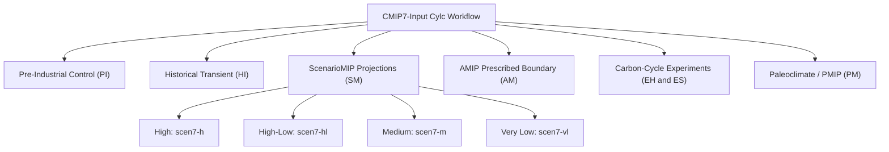

# Experiment Task Summaries Overview

ACCESS-ESM1.6 participates in multiple World Climate Research Programme (WCRP) CMIP7 endorsed activities. The `CMIP7-Input` suite provides unified ancillary generation across 7 experiment configurations.

---

## Supported Experiment Suites

---

## Experiment Summary Directory

Each experiment summary page provides:

1. **Scientific Overview:** Physical forcing scope, base years, and boundary conditions.
2. **Complete Task Roster:** An exhaustive tabular catalog of every workflow task required for that experiment, detailing entrypoint scripts, primary input datasets, output types, and deep links into the detailed [Forcing Specifications](../forcings/overview.md).
3. **Downstream Configuration Integration:** Target directories, modified namelist groups, and Git branching rules in `ACCESS-NRI/access-esm1.6-configs`.
4. **Execution Flow:** Cylc dependency graph (DAG) illustrating prerequisite relationships.

| Experiment Summary Page | Acronym | Tasks | Description |
| :--- | :---: | :---: | :--- |
| **[Pre-Industrial Control](pre_industrial.md)** | `PI` | 12 | 1850 perpetual equilibrium control run |
| **[Historical](historical.md)** | `HI` | 12 | 1850–2023 transient historical climate run |
| **[ScenarioMIP](scenariomip.md)** | `SM` | 46 | Future projections across `h`, `hl`, `m`, and `vl` (2022–2100 & 2022–2150) |
| **[AMIP](amip.md)** | `AM` | 7 | Prescribed observed SST and sea-ice concentration runs |
| **[Emission-Driven Experiments](emission_driven.md)** | `EH` & `ES` | 5 | Carbon-cycle interactive CO2 flux experiments |
| **[Paleoclimate / PMIP](pmip.md)** | `PM` | 2 | Climatological 1850–1870 equilibrium ozone forcing |
