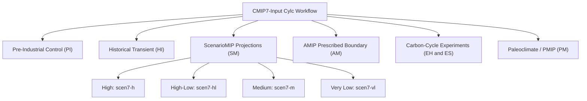

# Experiment Task Summaries Overview

ACCESS-ESM1.6 participates in multiple World Climate Research Programme (WCRP) CMIP7 endorsed activities. The `CMIP7-Input` suite provides unified ancillary generation across 7 experiment configurations.

---

## Supported Experiment Suites

```mermaid
graph TD
    Suite["CMIP7-Input Cylc Workflow"] --> PI["Pre-Industrial Control (PI)"]
    Suite --> HI["Historical Transient (HI)"]
    Suite --> SM["ScenarioMIP Projections (SM)"]
    Suite --> AM["AMIP Prescribed Boundary (AM)"]
    Suite --> Carbon["Carbon-Cycle Experiments (EH and ES)"]
    Suite --> PM["Paleoclimate / PMIP (PM)"]
    
    SM --> SM_h["High: scen7-h"]
    SM --> SM_hl["High-Low: scen7-hl"]
    SM --> SM_m["Medium: scen7-m"]
    SM --> SM_vl["Very Low: scen7-vl"]
```

---

## Experiment Summary Directory

Each experiment summary page provides:

1. **Scientific Overview:** Physical forcing scope, base years, and boundary conditions.
2. **Complete Task Roster:** An exhaustive tabular catalog of every workflow task required for that experiment, detailing entrypoint scripts, primary input datasets, output types, and deep links into the detailed [Forcing Specifications](../forcings/overview.md).
3. **Downstream Configuration Integration:** Target directories, modified namelist groups, and Git branching rules in `ACCESS-NRI/access-esm1.6-configs`.
4. **Execution Flow:** Cylc dependency graph (DAG) illustrating prerequisite relationships.

---

## Experiment Execution Switches & Selectors

The activation, scenario selection, and downstream branch mapping for all experiments are parameterized centrally in [`rose-suite.conf`](../configuration/suite_objects.md).

> [!TIP]
> For an evergreen reference describing all configuration objects, schemas, and semantics without hardcoded current values, see the [Suite Configuration & Parameters Reference](../configuration/suite_objects.md).

| Experiment Suite | Suite Toggle Switch | Pathway / Scenario Selectors | 2150 Extension Controls | Downstream Git Branch |
| :--- | :---: | :---: | :---: | :--- |
| **[Pre-Industrial Control](pre_industrial.md)** | `USE_EXP['PI']` | N/A | N/A | `GIT_CONFIG_BRANCH_PRE['PI']`-`GIT_CONFIG_BRANCH_SUF['PI']` (`dev-piControl`) |
| **[Historical](historical.md)** | `USE_EXP['HI']` | N/A | N/A | `GIT_CONFIG_BRANCH_PRE['HI']`-`GIT_CONFIG_BRANCH_SUF['HI']` (`dev-historical`) |
| **[ScenarioMIP](scenariomip.md)** | `USE_EXP['SM']` | `USE_SCEN['h']`, `['hl']`, `['m']`, `['vl']` | `EXTEND_SM_AEROSOL`, `_CO2`, `_GHG`, `_NITROGEN`, `_OZONE`, `_SOLAR`, `_VOLCANIC` | `GIT_CONFIG_BRANCH_PRE['SM']`-`GIT_SM_CONFIG_BRANCH_SUF['<SCEN>']` (`pl-scen7-<scen>`) |
| **[AMIP](amip.md)** | `USE_EXP['AM']` | N/A | N/A | Filesystem Ancillaries (`.anc`) |
| **[Emission-Driven](emission_driven.md)** | `USE_EXP['EH']`, `USE_EXP['ES']` | `USE_SCEN` (for `ES`) | `EXTEND_SM_CO2` | Filesystem Ancillaries (`.anc`) |
| **[Paleoclimate / PMIP](pmip.md)** | `USE_EXP['PM']` | N/A | N/A | Filesystem Ancillaries (`.anc`) |

---

| Experiment Summary Page | Acronym | Tasks | Description |
| :--- | :---: | :---: | :--- |
| **[Pre-Industrial Control](pre_industrial.md)** | `PI` | 12 | 1850 perpetual equilibrium control run |
| **[Historical](historical.md)** | `HI` | 12 | 1850–2023 transient historical climate run |
| **[ScenarioMIP](scenariomip.md)** | `SM` | 46 | Future projections across `h`, `hl`, `m`, and `vl` (2022–2100 & 2022–2150) |
| **[AMIP](amip.md)** | `AM` | 7 | Prescribed observed SST and sea-ice concentration runs |
| **[Emission-Driven Experiments](emission_driven.md)** | `EH` & `ES` | 5 | Carbon-cycle interactive CO2 flux experiments |
| **[Paleoclimate / PMIP](pmip.md)** | `PM` | 2 | Climatological 1850–1870 equilibrium ozone forcing |
