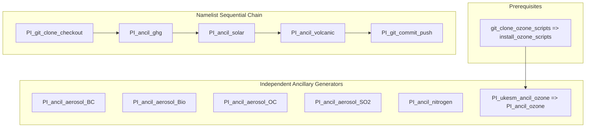

# Experiment Summary: Pre-Industrial Control (PI)

The Pre-Industrial Control (`PI` or `piControl`) experiment establishes the unperturbed pre-industrial climate baseline (representative of year 1850 conditions). It serves as the reference benchmark against which historical and scenario climate change forced responses are evaluated.

---

## Physical Forcing Rationale & Setup

The forcing suite provides time-invariant or cyclic climatological boundary conditions:
* **Greenhouse Gases:** Constant 1850 global-mean surface concentrations for 9 species patched into `&clmchfcg`.
* **Total Solar Irradiance:** Time-invariant pre-industrial solar constant $S_0 = 1361.603\,\text{W}\,\text{m}^{-2}$ patched into namelist variable `SC` in `&coupling`.
* **Volcanic Aerosols:** Mean background stratospheric aerosol optical depth (SAOD) calculated from UOEXETER climatology patched into `VOLCTS_val = 0.17` in `&coupling`.
* **Aerosol & DMS Emissions:** 12-month cyclic emissions of anthropogenic BC, OC, and SO2 from CEDS alongside marine DMS from CMIP6.
* **Biomass Burning:** 12-month cyclic particulate emissions from BB4CMIP7.
* **Reactive Nitrogen:** 12-month cyclic surface deposition fluxes from FZJ.
* **Ozone:** 12-month equilibrium 3D ozone concentrations derived from UKESM1.

---

## Complete Task Roster for Pre-Industrial Control

The following **12 Cylc workflow tasks** generate all necessary ancillaries and namelist patches for the `PI` configuration:

| Task Name | Forcing Domain | Python Script Entrypoint | Primary Input / Dataset | Output Type / Destination | Technical Specification |
| :--- | :--- | :--- | :--- | :--- | :---: |
| `PI_ancil_ghg` | Greenhouse Gases | `ghg.cmip7_PI_ghg_generate` | `CR-CMIP-1-0-0` (gm yr) | Namelist patch (`&clmchfcg`) | [View Card](../forcings/ghg.md#pi_ancil_ghg) |
| `PI_ancil_aerosol_BC` | Aerosols | `aerosol.cmip7_PI_BC_interpolate` | `CEDS-CMIP-2025-04-18` | `.anc` (`BC_1850_cmip7.anc`) | [View Card](../forcings/aerosols.md#pi_ancil_aerosol_bc) |
| `PI_ancil_aerosol_Bio` | Aerosols | `aerosol.cmip7_PI_Bio_interpolate`| `BB4CMIP7` biomass | `.anc` (`Bio_1850_cmip7.anc`) | [View Card](../forcings/aerosols.md#pi_ancil_aerosol_bio) |
| `PI_ancil_aerosol_OC` | Aerosols | `aerosol.cmip7_PI_OC_interpolate` | `CEDS-CMIP-2025-04-18` | `.anc` (`OCFF_1850_cmip7.anc`) | [View Card](../forcings/aerosols.md#pi_ancil_aerosol_oc) |
| `PI_ancil_aerosol_SO2` | Aerosols | `aerosol.cmip7_PI_SO2_interpolate`| `CEDS-CMIP` + ESM1.5 DMS | `.anc` (`scycl_1850_cmip7.anc`) | [View Card](../forcings/aerosols.md#pi_ancil_aerosol_so2) |
| `PI_ancil_nitrogen` | Nitrogen | `nitrogen.cmip7_PI_nitrogen_generate`| `FZJ-CMIP-nitrogen-1-2` | `.anc` (`Ndep_1850_cmip7.anc`) | [View Card](../forcings/nitrogen.md#pi_ancil_nitrogen) |
| `PI_ukesm_ancil_ozone` | Ozone | UKESM ozone toolchain | UKESM1 annual NetCDF | Intermediate NetCDF | [View Card](../forcings/ozone.md#pi_ukesm_ancil_ozone-pi_ancil_ozone) |
| `PI_ancil_ozone` | Ozone | `ozone.cmip7_PI_ozone_generate` | Intermediate NetCDF | `.anc` (`ozone_1850_cmip7.anc`) | [View Card](../forcings/ozone.md#pi_ukesm_ancil_ozone-pi_ancil_ozone) |
| `PI_ancil_solar` | Solar | `solar.cmip7_PI_solar_generate` | `SOLARIS-HEPPA-CMIP-4-6` (`fx`)| Namelist `SC` patch (`&coupling`) | [View Card](../forcings/solar.md#pi_ancil_solar) |
| `PI_ancil_volcanic` | Volcanic | `volcanic.cmip7_PI_volcanic_generate`| `UOEXETER-CMIP-2-2-1` (`ext`) | Namelist `VOLCTS_val` (`&coupling`)| [View Card](../forcings/volcanic.md#pi_ancil_volcanic) |
| `PI_git_clone_checkout`| Git Sync | Bash (`git clone`) | `access-esm1.6-configs` | Local workspace checkout | [View Card](../forcings/config_sync.md#pi_git_clone_checkout) |
| `PI_git_commit_push` | Git Sync | Bash (`git commit/push`) | Modified namelists / ancils | Downstream git configuration branch | [View Card](../forcings/config_sync.md#pi_git_commit_push) |

---

## Downstream Configuration Integration

The artifacts generated by the pre-industrial suite feed directly into the `dev-piControl` configuration branch in `access-esm1.6-configs`:
* **Namelist Updates:**
  * `atmosphere/input_atm.nml`: Updates `SC = 1361.603` and `VOLCTS_val = 0.17` in namelist group `&coupling`.
  * `atmosphere/namelists`: Updates `&clmchfcg` with 1850 mass mixing ratios for the 11 radiatively active gases.
* **Ancillary Installation:**
  Files installed into `/g/data/${PROJECT}/${USER}/CMIP7/esm1p6_ancil/<DATE>/modern/pre-industrial/`:
  * `atmosphere/aerosol/global.N96/<DATE>/` (`BC_1850_cmip7.anc`, `Bio_1850_cmip7.anc`, `OCFF_1850_cmip7.anc`, `scycl_1850_cmip7.anc`)
  * `atmosphere/nitrogen/global.N96/<DATE>/` (`Ndep_1850_cmip7.anc`)
  * `atmosphere/forcing/global.N96/<DATE>/` (`ozone_1850_cmip7.anc`)

---

## Execution Flow & Dependencies

