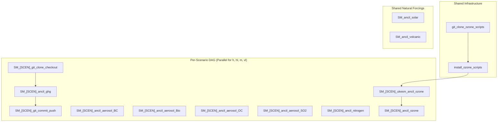

# Experiment Summary: ScenarioMIP (SM)

The Scenario Model Intercomparison Project (`ScenarioMIP` or `SM`) simulates future climate projections under alternative socioeconomic development and greenhouse gas emissions pathways spanning 2022 to 2100 (standard timeline) and extended to 2150 (long-term climate commitment and stabilization).

---

## Emissions Pathways & Experimental Design

ACCESS-ESM1.6 configures 4 core Tier-1 and Tier-2 ScenarioMIP pathways:

| Scenario | Pathway Description | Radiative Forcing Target | Narrative Context |
| :---: | :--- | :---: | :--- |
| **`h`** | High emissions | $\sim 8.5\,\text{W}\,\text{m}^{-2}$ by 2100 | Rapid fossil-fueled growth |
| **`hl`** | High-Low overshoot | High peak declining to low | Carbon removal & peak-and-decline |
| **`m`** | Medium emissions | $\sim 4.5\,\text{W}\,\text{m}^{-2}$ by 2100 | Intermediate climate policy action |
| **`vl`** | Very Low emissions | $\sim 1.9\,\text{W}\,\text{m}^{-2}$ by 2100 | Immediate aggressive mitigation ($1.5^\circ\text{C}$ target) |

### 2150 Extension Capabilities
Under the extended workflow mode (`EXTEND_SM_* = True` or CLI flag `--ext`), the suite automatically concatenates extension input datasets (`2101-2200` chunks for GHG and Aerosols) or applies constant-year tiling (`tile_constant_years` for Ozone to 2151; final-year tiling for Nitrogen) to deliver continuous, validated 2022–2150 forcing fields.

---

## Complete Task Roster for ScenarioMIP

The workflow orchestrates **46 tasks** supporting ScenarioMIP across the 4 pathways:

### 1. Per-Scenario Atmospheric Forcings ($4 \times 8 = 32$ tasks)

| Forcing Domain | Task Pattern (`<SCEN>` in `h, hl, m, vl`) | Script Entrypoint | Output Ancillary / Target | Technical Specification |
| :--- | :--- | :--- | :--- | :---: |
| **Greenhouse Gases** | `SM_<SCEN>_ancil_ghg` | `ghg.cmip7_SM_ghg_generate` | Namelist `&clmchfcg` (2022–2150) | [View Card](../forcings/ghg.md#3-scenariomip-experiment-sm) |
| **Black Carbon** | `SM_<SCEN>_ancil_aerosol_BC` | `aerosol.cmip7_SM_BC_interpolate` | `BC_<SCEN>_2022_2150_cmip7.anc` | [View Card](../forcings/aerosols.md#3-scenariomip-experiment-sm) |
| **Biomass Burning**| `SM_<SCEN>_ancil_aerosol_Bio`| `aerosol.cmip7_SM_Bio_interpolate`| `Bio_<SCEN>_2022_2150_cmip7.anc` | [View Card](../forcings/aerosols.md#3-scenariomip-experiment-sm) |
| **Organic Carbon** | `SM_<SCEN>_ancil_aerosol_OC` | `aerosol.cmip7_SM_OC_interpolate` | `OCFF_<SCEN>_2022_2150_cmip7.anc` | [View Card](../forcings/aerosols.md#3-scenariomip-experiment-sm) |
| **Sulfur Cycle** | `SM_<SCEN>_ancil_aerosol_SO2`| `aerosol.cmip7_SM_SO2_interpolate`| `scycl_<SCEN>_2022_2150_cmip7.anc` | [View Card](../forcings/aerosols.md#sm_hhlmvl_ancil_aerosol_so2) |
| **Nitrogen Dep.** | `SM_<SCEN>_ancil_nitrogen` | `nitrogen.cmip7_SM_nitrogen_generate` | `Ndep_<SCEN>_2022_2150_cmip7.anc` | [View Card](../forcings/nitrogen.md#3-scenariomip-experiment-sm) |
| **Ozone (Stage 1)**| `SM_<SCEN>_ukesm_ancil_ozone`| UKESM regridding toolchain | Intermediate NetCDF | [View Card](../forcings/ozone.md#4-scenariomip-experiment-sm) |
| **Ozone (Stage 2)**| `SM_<SCEN>_ancil_ozone` | `ozone.cmip7_SM_ozone_generate` | `ozone_<SCEN>_2022_2150_cmip7.anc` | [View Card](../forcings/ozone.md#4-scenariomip-experiment-sm) |

### 2. Shared Natural & Radiative Forcings (2 tasks)

| Task Name | Forcing Domain | Script Entrypoint | Output File | Description |
| :--- | :--- | :--- | :--- | :--- |
| `SM_ancil_solar` | Solar | `solar.cmip7_SM_solar_generate` | `TSI_CMIP7_ESM` | Projection solar variability (2022–2299) |
| `SM_ancil_volcanic`| Volcanic | `volcanic.cmip7_SM_volcanic_generate` | `volcts_cmip7.dat` | Post-2022 background volcanic optical depth |

### 3. Git Branch Synchronization (8 tasks)

* **Clone & Checkout:** `SM_{h,hl,m,vl}_git_clone_checkout` prepares branches `gen-scen7-{h,hl,m,vl}-<UUID>`.
* **Commit & Push:** `SM_{h,hl,m,vl}_git_commit_push` stages and commits the patched `&clmchfcg` namelists.

### 4. Interactive Carbon-Cycle CO2 Fluxes (4 tasks)

* `ES_{h,hl,m,vl}_ancil_co2` produces `CO2_fluxes_{scen}_2022_2150_cmip7.anc` for emission-driven runs ([View Card](../forcings/co2.md#2-emission-driven-scenariomip-experiment-es)).

---

## Downstream Configuration Integration

Each ScenarioMIP pathway targets a dedicated configuration branch in `access-esm1.6-configs`:

* **Branch Names:** `pl-scen7-h`, `pl-scen7-hl`, `pl-scen7-m`, `pl-scen7-vl`.
* **Namelists Patched:** `atmosphere/namelists` updated with 129 annual points (2022–2150) in `&clmchfcg`.
* **Output Directories:** `/g/data/${PROJECT}/${USER}/CMIP7/esm1p6_ancil/<DATE>/modern/scen7-<SCEN>/`.

---

## Execution Flow & Dependencies

