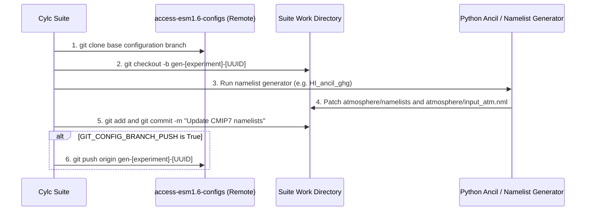

# Downstream Configuration Git Synchronization Specifications

The configuration synchronization pipeline automates the checkout, branching, patching, committing, and pushing of downstream model configuration files in [ACCESS-NRI/access-esm1.6-configs](https://github.com/ACCESS-NRI/access-esm1.6-configs).

---

## Architectural Role in the Workflow

Several CMIP7 forcings—specifically Greenhouse Gas concentrations (`&clmchfcg`), the Pre-Industrial Solar Constant (`SC` in `&coupling`), and Pre-Industrial Volcanic Optical Depth (`VOLCTS_val` in `&coupling`)—are ingested by the model directly through Fortran namelists rather than binary `.anc` files.

To maintain strict version control and reproducibility, the Cylc workflow manages these mutations through automated Git lifecycle tasks:



---

## 1. Pre-Industrial Experiment (PI)

### `PI_git_clone_checkout`
* **1. Description & Purpose:** Clones the downstream configuration repository (`access-esm1.6-configs`) on the pre-industrial base branch (`dev`), checks out a new run-specific branch `gen-piControl-<UUID>`, and establishes the workspace directory.
* **2. Execution Command:**  
  ```bash
  git clone --depth 1 -b ${GIT_CONFIG_BRANCH_PRE["PI"]}-${GIT_CONFIG_BRANCH_SUF["PI"]} \
      ${GIT_ORG_URL}/${GIT_CONFIG_REPO}.git ${CYLC_WORKFLOW_SHARE_DIR}/config/PI
  cd ${CYLC_WORKFLOW_SHARE_DIR}/config/PI
  git checkout -b gen-piControl-${UNIQUE_NAME}
  ```
* **8. Workspace Path:** `${CYLC_WORKFLOW_SHARE_DIR}/config/PI/`.

### `PI_git_commit_push`
* **1. Description & Purpose:** Commits the patched `atmosphere/namelists` (from `PI_ancil_ghg`) and `atmosphere/input_atm.nml` (from `PI_ancil_solar` and `PI_ancil_volcanic`). If `GIT_CONFIG_BRANCH_PUSH = true`, pushes the branch upstream to GitHub.
* **2. Execution Command:**  
  ```bash
  cd ${CYLC_WORKFLOW_SHARE_DIR}/config/PI
  git add atmosphere/namelists atmosphere/input_atm.nml
  git commit -m "Update CMIP7 pre-industrial forcings: GHG, Solar, and Volcanic"
  if [ "${GIT_CONFIG_BRANCH_PUSH}" = "true" ]; then
      git push origin gen-piControl-${UNIQUE_NAME}
  fi
  ```

---

## 2. Historical Experiment (HI)

### `HI_git_clone_checkout`
* **1. Description & Purpose:** Clones `access-esm1.6-configs` on branch `dev-historical`, creates `gen-historical-<UUID>`, and prepares directory for namelist modification.
* **8. Workspace Path:** `${CYLC_WORKFLOW_SHARE_DIR}/config/HI/`.

### `HI_git_commit_push`
* **1. Description & Purpose:** Stages and commits the patched `atmosphere/namelists` containing the 175-year annual greenhouse gas mass mixing ratio table generated by `HI_ancil_ghg`.
* **2. Execution Command:**  
  ```bash
  cd ${CYLC_WORKFLOW_SHARE_DIR}/config/HI
  git add atmosphere/namelists
  git commit -m "Update CMIP7 historical greenhouse gas forcing namelists (1850-2024)"
  if [ "${GIT_CONFIG_BRANCH_PUSH}" = "true" ]; then
      git push origin gen-historical-${UNIQUE_NAME}
  fi
  ```

---

## 3. ScenarioMIP Experiment (SM)

The workflow manages independent Git branches for each future projection scenario (`h`, `hl`, `m`, `vl`):

### `SM_{h,hl,m,vl}_git_clone_checkout`
* **1. Description & Purpose:** Clones base branch `${GIT_CONFIG_BRANCH_PRE["SM"]}-${GIT_SM_CONFIG_BRANCH_SUF[SCEN]}` (e.g. `pl-scen7-h`), checking out `gen-scen7-<SCEN>-<UUID>`.
* **8. Workspace Path:** `${CYLC_WORKFLOW_SHARE_DIR}/config/SM/<SCEN>/`.

### `SM_{h,hl,m,vl}_git_commit_push`
* **1. Description & Purpose:** Commits the future projection greenhouse gas table (`clim_fcg_years = 2022..2150` under `--ext`) into `atmosphere/namelists`.
* **2. Execution Command:**  
  ```bash
  cd ${CYLC_WORKFLOW_SHARE_DIR}/config/SM/${SCEN}
  git add atmosphere/namelists
  git commit -m "Update CMIP7 ScenarioMIP ${SCEN} greenhouse gas forcings (2022-2150)"
  if [ "${GIT_CONFIG_BRANCH_PUSH}" = "true" ]; then
      git push origin gen-scen7-${SCEN}-${UNIQUE_NAME}
  fi
  ```

---

## Suite Concurrency & Dependency Graph

To prevent simultaneous file writes and Git index collisions, `flow.cylc` enforces explicit sequential barriers:

* **Race Condition Prevention:** `PI_ancil_solar => PI_ancil_volcanic` ensures both tasks cleanly patch `atmosphere/input_atm.nml` without clobbering.
* **Git Commit Sequencing:** `*_git_clone_checkout => *_ancil_ghg => *_git_commit_push` ensures all namelist patching finishes before committing.
