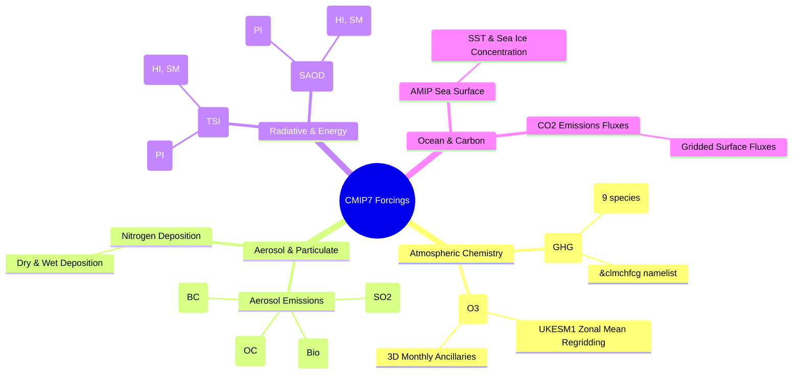

# Forcing Specifications Overview

The `CMIP7-Input` suite processes raw climate forcing datasets into formats directly ingestible by the Unified Model (UM) and the CABLE land surface model within ACCESS-ESM1.6.

---

## Physical Forcing Domains

The workflow processes 8 distinct physical forcing domains alongside automated model configuration synchronization:

---

## Technical Specifications Hierarchy

Within each forcing domain, technical specifications are organized hierarchically:
1. **Physical Overview:** Description of scientific inputs, units, target grids, and UM STASH codes.
2. **Experiment Breakdown:** Detailed task profiles sub-grouped by experiment:
   - **Pre-Industrial (`PI`):** Climatological or perpetual 1850 conditions.
   - **Historical (`HI`):** Continuous 1850–2023 transient historical forcings.
   - **ScenarioMIP (`SM`):** Future projection pathways (`h`, `hl`, `m`, `vl`), supporting standard 2022–2100 timelines and extended 2022–2150 timelines.
   - **Emission-Driven (`EH`, `ES`):** Carbon-cycle interactive flux forcings.
   - **AMIP (`AM`):** Prescribed boundary condition experiments.

Each task specification provides exhaustive coverage across the **9 technical dimensions**, detailing CLI invocations, exact input4MIPs file locations on NCI Gadi, Python library call chains, Iris cube transformations and coordinate constraints, produced file paths, and downstream namelist mutations.

---

## Navigation

Explore the individual forcing domain specifications below:

| Forcing Domain | Description | Output Formats | Member Tasks |
| :--- | :--- | :--- | :---: |
| **[Greenhouse Gases (GHG)](ghg.md)** | Global-mean annual surface concentrations (9 species) | Namelist `&clmchfcg` | 6 |
| **[Aerosols](aerosols.md)** | Gridded monthly emissions for BC, OC, Bio, and SO2/DMS | Ancillary `.anc` | 24 |
| **[Carbon Dioxide Fluxes](co2.md)** | Gridded monthly CO2 surface emissions fluxes | Ancillary `.anc` | 5 |
| **[Nitrogen Deposition](nitrogen.md)** | Gridded monthly reactive nitrogen deposition | Ancillary `.anc` | 6 |
| **[Ozone Pipeline](ozone.md)** | Zonal-mean monthly 3D ozone concentrations | Intermediate NetCDF + Ancillary `.anc` | 14 |
| **[Solar Irradiance](solar.md)** | Total Solar Irradiance (TSI) constant and timeseries | Namelist `SC` + ASCII `.dat` | 3 |
| **[Volcanic Optical Depth](volcanic.md)** | Stratospheric Aerosol Optical Depth (SAOD) | Namelist `VOLCTS_val` + ASCII `.dat` | 3 |
| **[AMIP (SST & Sea Ice)](amip.md)** | Monthly SST and sea-ice concentration | Ancillary `.anc` | 7 |
| **[Configuration Git Sync](config_sync.md)** | Automated branching, committing, and pushing | Git branches on `access-esm1.6-configs` | 14 |
