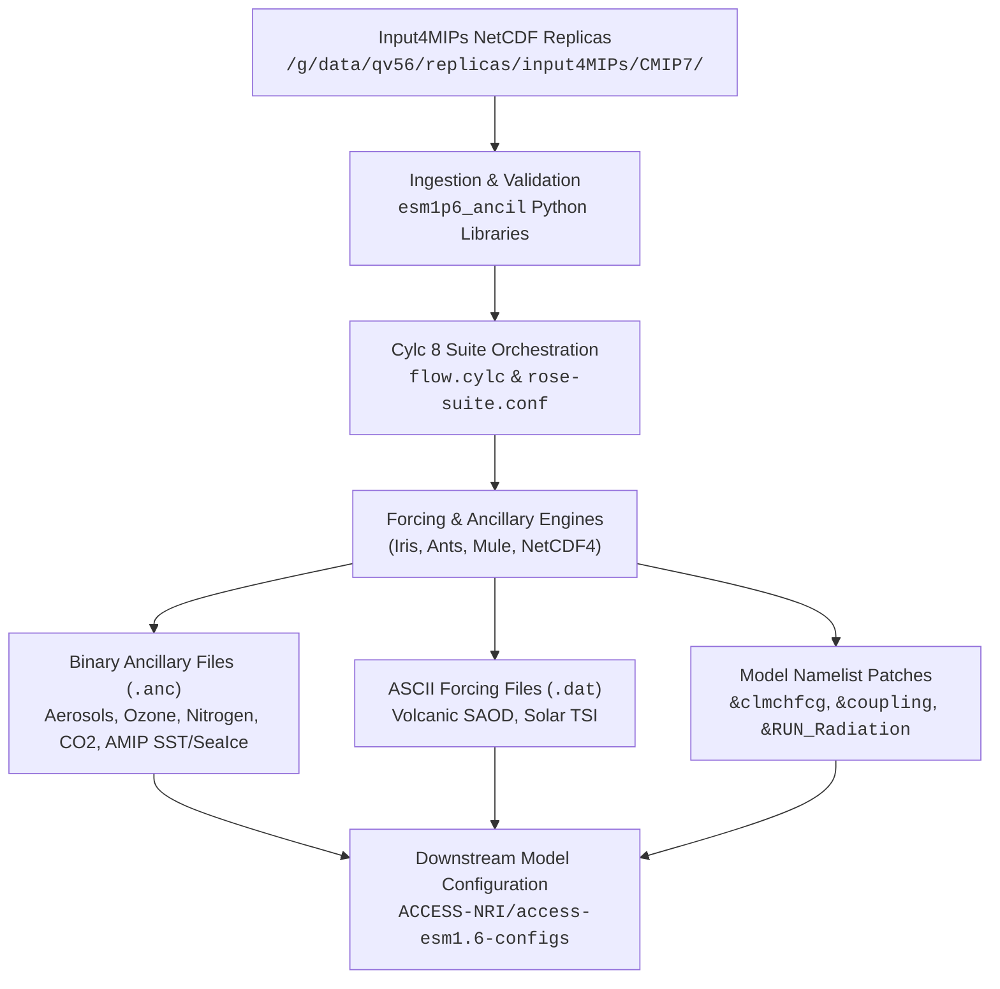

# CMIP7-Input Documentation

Welcome to the technical documentation for [ACCESS-NRI/CMIP7-Input](https://github.com/ACCESS-NRI/cmip7-input), the ancillary generation and forcing interpolation workflow for [ACCESS-ESM1.6](https://github.com/ACCESS-NRI/access-esm1.6-configs).

---

## Overview

The `CMIP7-Input` suite automates the ingestion, regridding, temporal interpolation, formatting, and model configuration patching of CMIP7 [input4MIPs](https://esgf-node.llnl.gov/projects/input4mips/) datasets. Orchestrated by a unified [Cylc 8](https://cylc.github.io/) workflow, the system produces binary Unified Model (UM) ancillary files (`.anc`), ASCII boundary condition tables (`.dat`), and Fortran namelist patches (`&clmchfcg`, `&coupling`, `&RUN_Radiation`) required across historical, pre-industrial, emission-driven, and future projection climate experiments.

---

## Documentation Structure

This documentation is organized into two complementary perspectives to support both domain scientists focused on specific physical forcings and model operators configuring experiments:

### 1. [Forcing Specifications](forcings/overview.md)
Detailed 9-dimension technical specifications for all workflow tasks, grouped by physical forcing domain and sub-grouped by experiment:
* **[Greenhouse Gases (GHG)](forcings/ghg.md):** Annual global-mean surface concentrations and `&clmchfcg` namelist patching.
* **[Aerosol Emissions](forcings/aerosols.md):** Anthropogenic surface, aircraft, biomass burning, and background DMS emissions (`BC`, `Bio`, `OC`, `SO2`).
* **[Carbon Dioxide Fluxes](forcings/co2.md):** Spatially distributed monthly surface CO2 emissions for carbon-cycle experiments.
* **[Nitrogen Deposition](forcings/nitrogen.md):** Reactive nitrogen deposition ancillaries (`Ndep`).
* **[Ozone Pipeline](forcings/ozone.md):** Multi-stage UKESM1 zonal-mean regridding and UM ozone ancillary generation.
* **[Solar Irradiance](forcings/solar.md):** Total Solar Irradiance (TSI) constant and annual timeseries (`TSI_CMIP7_ESM`).
* **[Volcanic Optical Depth](forcings/volcanic.md):** Stratospheric aerosol optical depth (SAOD) constants and timeseries (`volcts_cmip7.dat`).
* **[AMIP (SST & Sea Ice)](forcings/amip.md):** UKESM-derived sea surface temperature and sea-ice concentration ancillaries.
* **[Configuration Git Synchronization](forcings/config_sync.md):** Automated cloning, branching, namelist injection, and git synchronisation for `access-esm1.6-configs`.

### 2. [Experiment Task Summaries](experiments/overview.md)
Comprehensive summary pages outlining all tasks, execution flows, and configuration parameters needed for each supported climate experiment:
* **[Pre-Industrial Control (PI)](experiments/pre_industrial.md):** Perpetual 1850 climatological forcing suite (12 tasks).
* **[Historical (HI)](experiments/historical.md):** Time-evolving 1850–2023 historical transient forcing suite (12 tasks).
* **[ScenarioMIP (SM)](experiments/scenariomip.md):** Future projections across pathways `h`, `hl`, `m`, and `vl`, supporting both standard (to 2100) and extended (to 2150) timelines (46 tasks).
* **[AMIP (AM)](experiments/amip.md):** Prescribed sea surface temperature and sea-ice boundary conditions (7 tasks).
* **[Emission-Driven Experiments (EH & ES)](experiments/emission_driven.md):** Carbon-cycle interactive CO2 emission experiments (5 tasks).
* **[Paleoclimate / PMIP (PM)](experiments/pmip.md):** Equilibrium paleoclimate ozone boundary conditions.

---

## The 9 Technical Dimensions

Every task specification in this documentation provides exhaustive coverage across 9 technical dimensions:
1. **Description & Purpose:** Physical domain scope and role in the workflow.
2. **CLI Arguments Passed:** Complete command-line arguments and flags.
3. **Input4MIPs Versions & Temporal Coverage:** Dataset versions, `vdate` timestamps, and date ranges.
4. **Input4MIPs Directory Paths & Filenames:** Absolute source file paths and naming patterns.
5. **Python Scripts & Functions Called:** Entrypoint script and internal calling structure.
6. **Function-Level Cube Transformations & Constraints:** Input and created Iris cubes, coordinate bounds handling, and applied constraints (name, date, wavelength).
7. **Produced File Versions & Date Ranges:** Ancillary versioning, temporal coverage, and calendar alignment.
8. **Produced File Directory Paths & Filenames:** Destination paths and output filenames.
9. **Namelist Updates:** Target namelist file, namelist group, and modified variables (or `None` for binary `.anc` files).

---

## Licensing & Acknowledgments

* **Code License:** Apache License 2.0.
* **Input Data:** CMIP7 input4MIPs datasets distributed via the Earth System Grid Federation (ESGF) and hosted locally on NCI Gadi (`/g/data/qv56/replicas/input4MIPs/CMIP7/`).
* **Governance:** Developed and maintained by the [Australian Climate and Earth System Simulator National Research Infrastructure (ACCESS-NRI)](https://www.access-nri.org.au/).
